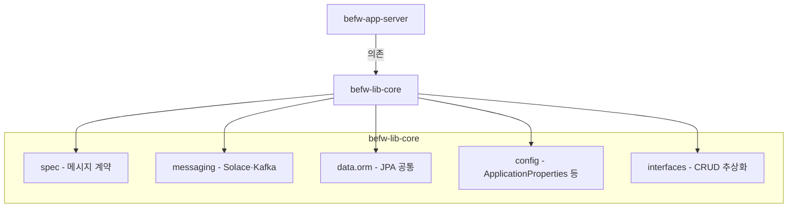
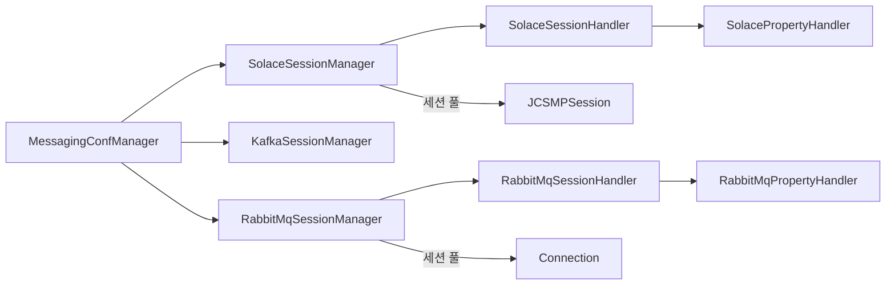

# befw-lib-core — 공통 코어 라이브러리

## 프로젝트 개요

| 항목               | 내용                                            |
|------------------|-----------------------------------------------|
| **역할**           | 전 모듈 공통 인프라 라이브러리 (Nexus 배포), 서비스 공통 기능 라이브러리 |
| **GroupId**      | `com.tsh.starter.befw`                        |
| **ArtifactId**   | `befw-lib-core`                               |
| **Version**      | `1.0.0-SNAPSHOT`                              |
| **Parent**       | `befw:1.0-SNAPSHOT`                           |
| **Base Package** | `com.tsh.starter.befw.lib.core`               |

---

## 아키텍처 개요

---

## 패키지 구조

### 1. `spec` — 메시지 계약 (AP 메시지 표준)

| 클래스                              | 역할                                                                                                                                    |
|----------------------------------|---------------------------------------------------------------------------------------------------------------------------------------|
| `ApMessage`                      | 모든 메시지의 최상위 클래스. `head` 필드 보유                                                                                                         |
| `ApMessageHead`                  | 메시지 헤더: `src`, `tgt`, `traceId`, `eventNm`                                                                                            |
| `ApMessageBody`                  | 메시지 Body 마커 인터페이스                                                                                                                     |
| `ApMessageList` (enum)           | 지원 이벤트 목록: `InitializeData`, `AddMsgServerInfo`, `HealthCheckReq`, `HealthCheckRep`, `HealthCheckTriggerReq`, `HealthCheckTriggerRep` |
| `ApSystemList` (enum)            | 시스템 구분: `SERVER`, `UI`, `AGENT`                                                                                                       |
| `spec/in/*`                      | 수신 메시지 정의 (`HealthCheckTriggerReq`, `HealthCheckRep`, `AddMsgServerInf`)                                                              |
| `spec/out/*`                     | 발신 메시지 정의 (`HealthCheckReq`, `HealthCheckTriggerRep`)                                                                                 |
| `spec/process/ApCommonProcessVo` | 처리 컨텍스트 VO (공통)                                                                                                                       |
| `spec/process/ApMessageVo`       | 메시지 처리 VO                                                                                                                             |
| `spec/common/ResultVo`           | 공통 결과 VO                                                                                                                              |

## 폴더 및 파일 생성 규칙

- App 모듈은 단위 서비스에 대한 개발 수행
- 모든 파일이나 폴더는 단위 서비스로 식별이 가능해야함
- 주요 폴더
    - 데이터 관련 폴더 및 파일
        - 경로
            - com/tsh/starter/befw/lib/core/data/orm
        - 기준
            1. 폴더는 테이블 이름의 prefix를 제외한 글자의 camel-case로 생성
                - ex) ST_ORG_WRKR_REL: stOrgWrkRel 로 표현
            2. 각 파일 성격에 따른 파일 명
                - JPA Service
                    - 기본 테이블 명 뒤에 "Access" 로 파일 명 생성
                        - ex) GS_SOL_MSG_REP 테이블의 JPA Service: GsSolMsgRepAccess
                - Entity
                    - 기본 테이블 명 뒤에 "Model" 로 파일 명 생성
                        - ex) GS_SOL_MSG_REP 테이블의 Entity: GsSolMsgRepModel
                - Jpa Repository
                    - 기본 테이블 명 뒤에 "Repo" 로 파일 명 생성
                        - ex) GS_SOL_MSG_REP Jpa Repository: GsSolMsgRepRepo
            3. 유형별 네이밍
                - 클래스: 첫 글자 대문자로 생성
                - 폴더: 첫 글자는 소문자로 생성

  ---

## 데이터 처리 개발론

- apService 죽 biz 로직을 처리하는 Service에서는 data의 Access Service Layer를 통해서만 데이터 작업을 한다.
- apService에서 JPA Repository를 통해 직접적으로 데이터를 조회하면 안된다.

---

### 2. `messaging` — 메시징 인프라

| 클래스                             | 역할                                                                |
|---------------------------------|-------------------------------------------------------------------|
| `MessagingConfManager`          | `@PostConstruct` 시점에 DB에서 메시징 서버 정보 로드, Solace·Kafka·RabbitMQ 세션 초기화 |
| `AbstractMessageSessionManager` | 세션 생명주기 추상화 (`startSession`, `stopSession`, `checkSession`)       |
| `SolaceSessionManager`          | Solace 세션 풀 관리 (`DEFAULT` 키 기반 ConcurrentHashMap)                 |
| `SolaceSessionHandler`          | 단일 Solace 연결 핸들러                                                  |
| `SolacePropertyHandler`         | DB 모델 → Solace 연결 속성 변환                                           |
| `SolaceInboundManager`          | 큐 구독 플로우 관리                                                       |
| `SolaceInboundGateway`          | 인바운드 게이트웨이 추상                                                     |
| `SolaceMessageReceiver`         | 구독 콜백 인터페이스                                                       |
| `SolaceMessagePublisher`        | Topic 발행 (`publishToTopic`)                                       |
| `SolacePublishCallback`         | 발행 콜백 처리                                                          |
| `SolaceQueueDiscovery`          | 큐 패턴 기반 자동 탐색 (`findQueuesByPattern`)                             |
| `SolaceOutBoundMessage`         | 발신 메시지 VO                                                         |
| `KafkaSessionManager`           | Kafka 세션 관리 (골격만 구현)                                              |
| `RabbitMqSessionManager`        | RabbitMQ 세션 풀 관리 (`DEFAULT` 키 기반 ConcurrentHashMap)               |
| `RabbitMqSessionHandler`        | 단일 RabbitMQ Connection/Channel 핸들러                                |
| `RabbitMqPropertyHandler`       | DB 모델 → RabbitMQ `ConnectionFactory` 변환                           |
| `RabbitMqInboundManager`        | 큐 구독 Consumer 자동 등록                                               |
| `RabbitMqInboundGateway`        | 인바운드 게이트웨이 (Queue별 전용 Channel + Consumer 관리)                     |
| `RabbitMqMessageReceiver`       | 구독 콜백 인터페이스                                                       |
| `RabbitMqMessagePublisher`      | Queue 발행(`publishToQueue`, Publisher Confirm 기반 재시도/DLQ) · Exchange 발행(`publishToTopic`) |
| `RabbitMqPublishCallback`       | Publisher Confirm(ACK/NACK) 콜백 처리                                 |
| `RabbitMqOutBoundMessage`       | 발신 메시지 VO                                                         |

**세션 키 규칙**

- Default 연결: `"DEFAULT"`
- 비Default: `"{env}|{domain}"`

### 3. `data.orm` — JPA 공통 계층

#### 공통 Base Model

| 클래스          | 역할                                                                                                                 |
|--------------|--------------------------------------------------------------------------------------------------------------------|
| `BaseModel`  | 모든 Entity 최상위. `srvId`, `tenant`, `traceId`, `useStatCd`, `evtNm`, `prevEvntNm` 포함. Hibernate Envers `@Audited` 적용 |
| `BasicAudit` | `createdBy`, `createdAt`, `modifiedBy`, `modifiedAt` (Spring Data Auditing)                                        |

**공통 BaseModel 컬럼**

| 컬럼                  | 설명                             |
|---------------------|--------------------------------|
| `OBJ_ID`            | PK (UUID)                      |
| `SRV_ID`            | 서비스 이름                         |
| `TENANT`            | 테넌트 구분                         |
| `TRACE_ID`          | 트레이스 ID                        |
| `USE_STAT_CD`       | 사용 상태 (`Usable`, `Disabled` 등) |
| `EVNT_NM`           | 이벤트 이름                         |
| `PREV_EVNT_NM`      | 이전 이벤트 이름                      |
| `ACT_CM` / `ACT_CD` | 액션 코멘트 / 코드                    |

#### 도메인 Entity

| Entity              | 테이블               | 설명                                                                  |
|---------------------|-------------------|---------------------------------------------------------------------|
| `GsMsgSrvConnModel` | `GS_MSG_SRV_CONN` | 메시징 서버 연결 정보. UK: `(env, sol_nm, host, port)`. `@Audited` 적용        |
| `GsSolMsgRepModel`  | `GS_SOL_MSG_REP`  | Solace 메시지 Reply 상태 추적. UK: `(reqSrvNm, reqTraceId)`. `@Audited` 적용 |

#### 공통 CRUD 추상화

| 클래스·인터페이스                         | 역할                                                     |
|-----------------------------------|--------------------------------------------------------|
| `CrudService<M, ID>`              | CRUD 서비스 인터페이스                                         |
| `AbstractCrudService<M, ID>`      | 공통 CRUD 구현 (findAll, findById, create, update, delete) |
| `UkCrudService` / `UkCrudSupport` | Unique Key 기반 upsert 지원                                |
| `BaseJpaRepository<M, ID>`        | 공통 JPA Repository                                      |

#### Tenant 처리

| 클래스                                            | 역할                                                 |
|------------------------------------------------|----------------------------------------------------|
| `TenantContext`                                | ThreadLocal 기반 Tenant 컨텍스트 (`set`, `get`, `clear`) |
| `TenantResolver` / `ThreadLocalTenantResolver` | Hibernate 멀티테넌트 Resolver                           |
| `AuditorAwareImpl`                             | Spring Data Auditing용 현재 사용자 제공                    |

#### 상수

| Enum                    | 값                             |
|-------------------------|-------------------------------|
| `MessagingSolutionType` | `Solace`, `Kafka`, `RabbitMq`  |
| `UseYn`                 | `Y`, `N`                      |
| `UseStatCd`             | `Usable`, `Disabled` 등        |
| `MsgRepStatCd`          | `Start`, `Complete`, `Fail` 등 |

### 4. `config` — 설정

| 클래스                     | 역할                                                                                           |
|-------------------------|----------------------------------------------------------------------------------------------|
| `ApplicationProperties` | `application.yml` 값을 static 필드로 노출 (`tenant`, `moduleName`, `version`, `serviceName`, `env`) |
| `MessagingProperties`   | Solace·Kafka·RabbitMQ enable/pub/sub 플래그 바인딩                                                 |
| `SwaggerConfig`         | SpringDoc OpenAPI 설정                                                                         |
| `JpaConfig`             | JPA·Envers 설정                                                                                |

### 5. `interfaces` — REST 추상화

| 클래스                                       | 역할                                                    |
|-------------------------------------------|-------------------------------------------------------|
| `CrudController<REQ, RES, ID>`            | CRUD REST 엔드포인트 인터페이스                                 |
| `AbstractCrudController<REQ, RES, M, ID>` | CRUD 공통 구현 (GET/POST/PUT/DELETE). `X-Tenant` 헤더 필수    |
| `ApiResponse<T>`                          | 통일된 API 응답 래퍼 (`ok`, `created`, `error`, `noContent`) |
| `InterfaceType`                           | 요청 진입 경로 구분 (`HTTP`, `SOLACE` 등)                      |

---

## 에러 처리

| 클래스                      | 역할                       |
|--------------------------|--------------------------|
| `JpaExceptionHandler`    | JPA 예외 → 표준 에러 응답 변환     |
| `DataErrorCode`          | 데이터 계층 에러 코드             |
| `DataErrorResponse`      | 에러 응답 DTO                |
| `TenantMissingException` | TenantContext가 비어있을 때 발생 |

---

## 테스트

| 테스트 클래스                         | 범위                                |
|---------------------------------|-----------------------------------|
| `JpaExceptionHandlerTest`       | JPA 예외 변환 단위 테스트                  |
| `TenantContextTest`             | ThreadLocal 기반 Tenant 컨텍스트 단위 테스트 |
| `ThreadLocalTenantResolverTest` | Tenant Resolver 단위 테스트            |
| `UkCrudSupportTest`             | UK 기반 upsert 로직 단위 테스트            |

---

## 미정의 항목 (정의 필요)

| # | 항목                             | 현재 상태                                   |
|---|--------------------------------|-----------------------------------------|
| 1 | `KafkaSessionManager` 구현       | 골격(stub)만 존재, 실제 Kafka 연결 로직 미구현        |
| 2 | `ApMessageBody` 마커 인터페이스 구현 규칙 | 구현체 작성 가이드 없음                           |
| 3 | `GlobalTableName` 상수 네이밍 규칙    | 확장 시 명명 규칙 정의 필요                        |
| 4 | Envers 이력 조회 API               | `*_HIST` 테이블 생성은 되나 조회 방법 미정의           |
| 5 | `AuditorAwareImpl` 사용자 정보 출처   | 현재 어떤 값이 `createdBy`로 들어가는지 미확인         |
| 6 | Solace SSL 인증서 경로              | `application.yml`에 `C:\` 임시값, 운영 경로 미정의 |
| 7 | `SolaceQueueDiscovery` 패턴 관리   | `TET.REQ.*` 하드코딩, 설정화 필요 여부 검토          |
